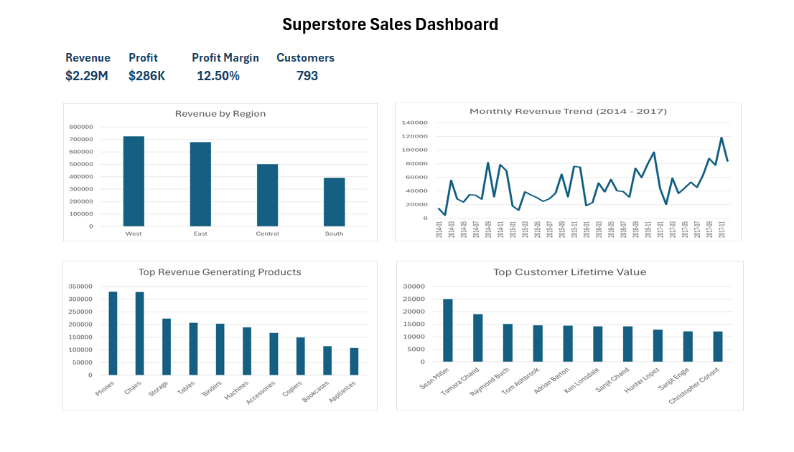
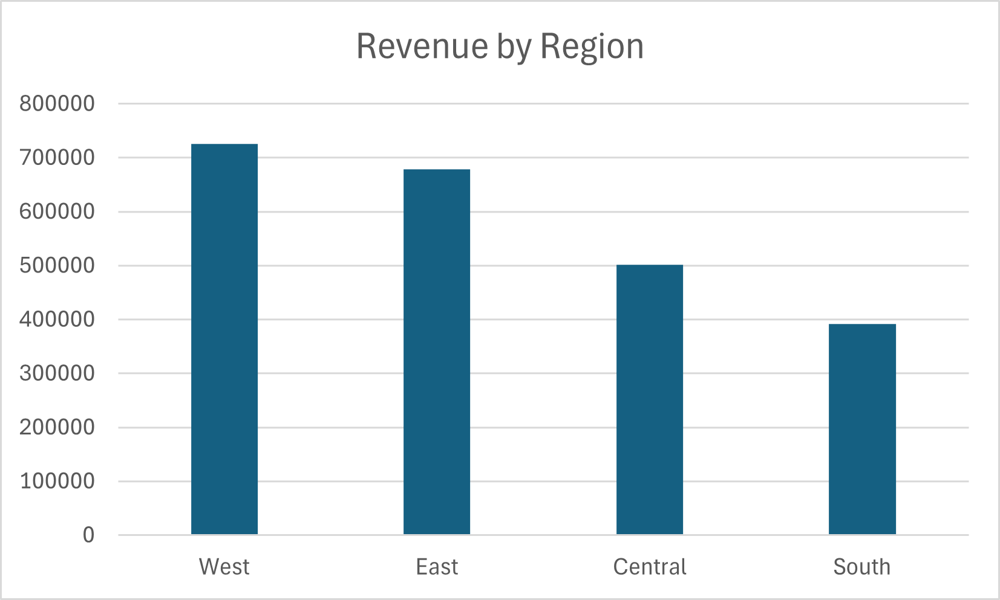
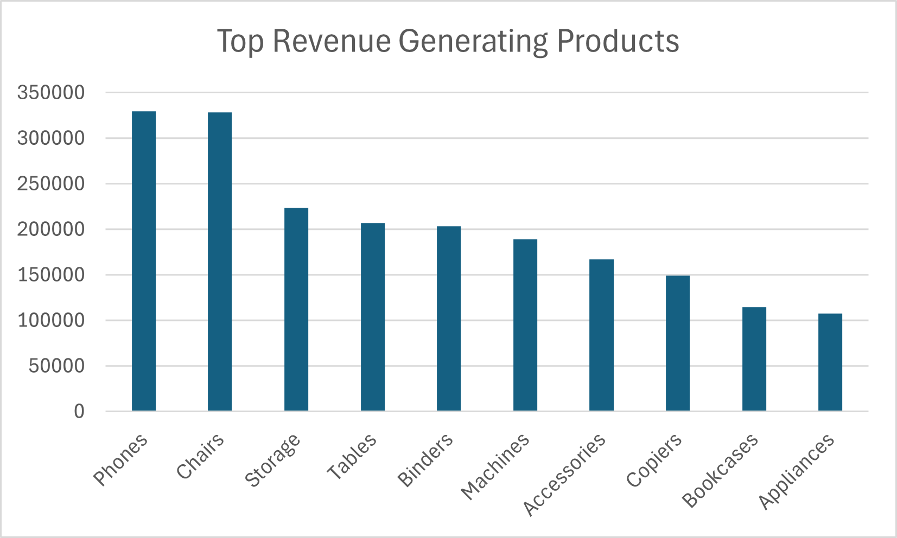
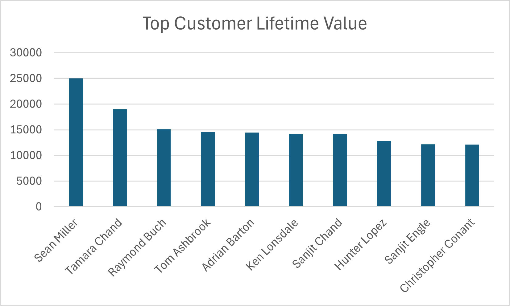

# 📊 Superstore Sales SQL Analysis

A real-world SQL Data Analytics project built using the Superstore dataset. This project demonstrates key SQL concepts used in Data Analyst roles, including aggregations, filtering, window functions, customer segmentation, KPI reporting, and business insight generation.

---

## 🚀 Project Overview

The goal of this project is to analyze retail sales data and answer common business questions using SQL.

The analysis covers:

* Revenue Performance
* Profitability Analysis
* Customer Lifetime Value (CLV)
* Regional Sales Trends
* Product Performance
* Customer Segmentation

---

## 🛠️ Tools & Technologies

* SQL (SQLite / PostgreSQL)
* Excel
* Git & GitHub

---

## 📈 Dashboard Preview



---

## 📊 Key Performance Indicators

| KPI             |     Value |
| --------------- | --------: |
| Total Revenue   |    $2.29M |
| Total Profit    |     $286K |
| Profit Margin   |    12.50% |
| Total Customers |       793 |
| Analysis Period | 2014–2017 |

---

## 📌 Business Questions Answered

### 1. Which products generate the highest revenue?

Identify top-performing products based on total sales.

### 2. Which region contributes the most revenue?

Compare sales performance across all regions.

### 3. Who are the most valuable customers?

Calculate Customer Lifetime Value (CLV).

### 4. How does revenue change over time?

Analyze monthly revenue trends and seasonality.

### 5. Which products perform best within each category?

Rank products using SQL window functions.

### 6. How can customers be segmented?

Group customers based on purchasing behavior.

---

## 🔍 SQL Concepts Demonstrated

* SELECT
* WHERE
* GROUP BY
* HAVING
* ORDER BY
* Aggregate Functions
* COUNT DISTINCT
* CASE WHEN
* Common Table Expressions (CTEs)
* Window Functions
* ROW_NUMBER()
* PARTITION BY
* LAG()

---

## 📂 Project Structure

```text
Superstore-Sales-SQL-Analysis
│
├── README.md
├── superstore.sql
│
├── results
│   ├── query1_top_products.csv
│   ├── query2_regional_performance.csv
│   ├── query3_customer_ltv.csv
│   ├── query4_monthly_trends.csv
│   ├── query5_top_per_category.csv
│   └── query6_customer_segments.csv
│
└── screenshots
    ├── dashboard_overview.png
    ├── revenue_by_region.png
    ├── monthly_sales_trend.png
    ├── top_revenue_products.png
    └── customer_ltv.png
```

---

## 📊 Dashboard Visualizations

### Complete Dashboard Overview


### Revenue by Region



### Monthly Revenue Trend


### Top Revenue Generating Products



### Top Customer Lifetime Value



---

## 💡 Key Insights

### Regional Performance

* West region generated the highest revenue.
* South region generated the lowest revenue.

### Product Analysis

* Phones and Chairs generated the highest sales.
* Technology products consistently outperformed other categories.

### Customer Analysis

* Top customers generated significantly higher revenue than average customers.
* Loyal customers contributed a large share of total sales.

### Revenue Trends

* Revenue showed steady growth from 2014 to 2017.
* Strong seasonal spikes were observed during year-end months.

---

## 🎯 Skills Demonstrated

✔ Data Analysis

✔ SQL Query Writing

✔ Business Intelligence

✔ KPI Reporting

✔ Revenue Analysis

✔ Customer Analytics

✔ Dashboard Design

✔ Data Visualization

✔ Problem Solving

---

## ▶️ How to Run

1. Import the Superstore dataset into SQLite or PostgreSQL.
2. Open `superstore.sql`.
3. Execute the queries individually.
4. Review outputs stored in the `results` folder.
5. Compare findings with dashboard visualizations.

---

## 📈 Project Impact

* Analyzed 9,994 retail transactions.
* Generated insights from $2.29M in sales data.
* Built 6 business-focused SQL queries.
* Created an executive dashboard for KPI tracking.
* Demonstrated end-to-end data analysis workflow.

---

## 👨‍💻 Author

**Garnipudi Nani**

GitHub: https://github.com/GarnipudiNani

LinkedIn: https://www.linkedin.com/in/nani-garnipudi-534817376/

---

## ⭐ If you found this project useful, consider giving it a star.
